:books: # jjngmore :books:
==========================
jsp/Servlet을 이용한 자격증 포털 사이트 구현

## 서비스 개요
기존 Q-net을 이용할 때 사용자 맞춤형 서비스를 제공 받을 수 없던 점을 보완하고자 한 프로젝트이다.
관심 자격증을 등록하고 이에 따른 시험 일정을 수신 받을 수 있게 구현하였고, 같은 자격증을 준비하는 스터디를 모집할 수 있도록 게시판을 두었다. 

## 서비스 기능
* Q-net에서 제공하는 자격증 정보를 통해 자격 요건과 자격증 관련 정보를 검색할 수 있음.
* 시험 일정이 표기된 캘린더 제공함.
* 관심 자격증을 등록할 수 있음.
* 관심 자격증으로 등록한 자격증에 대한 일정을 확인할 수 있음.
* 개인 메시지함에 관심 자격증으로 등록한 자격증의 시험 일정 3, 5, 7일전 알림을 수신할 수 있음.
* 공지사항, 자유게시판, 스터디 게시판 등을 통해 커뮤니케이션할 수 있음.

## 사용 언어 및 라이브러리
* jsp/Servlet(Java)
* HTML
* JavaScript, jQuery, ajax
* sql

## 사용 Tool
* Eclipse photon
* Visual Studio Code
* MySQL workbench
* Git Bash

## 사용 API
* 공공데이터 포탈 API
* Q-net API

## :green_book: 기능 상세 설계(플로우)
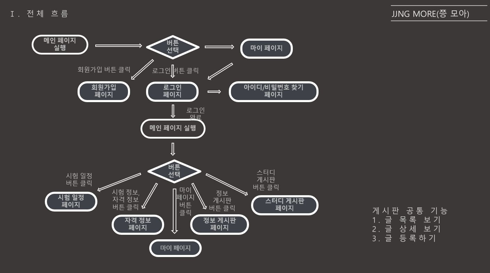

## 화면 구현
* 메인 페이지
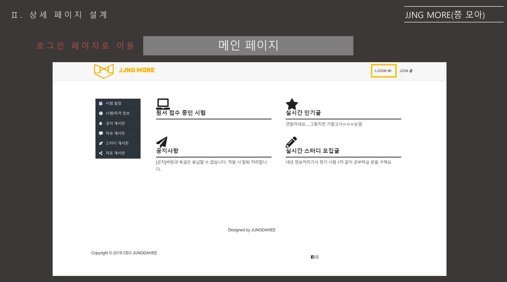

* 로그인 페이지
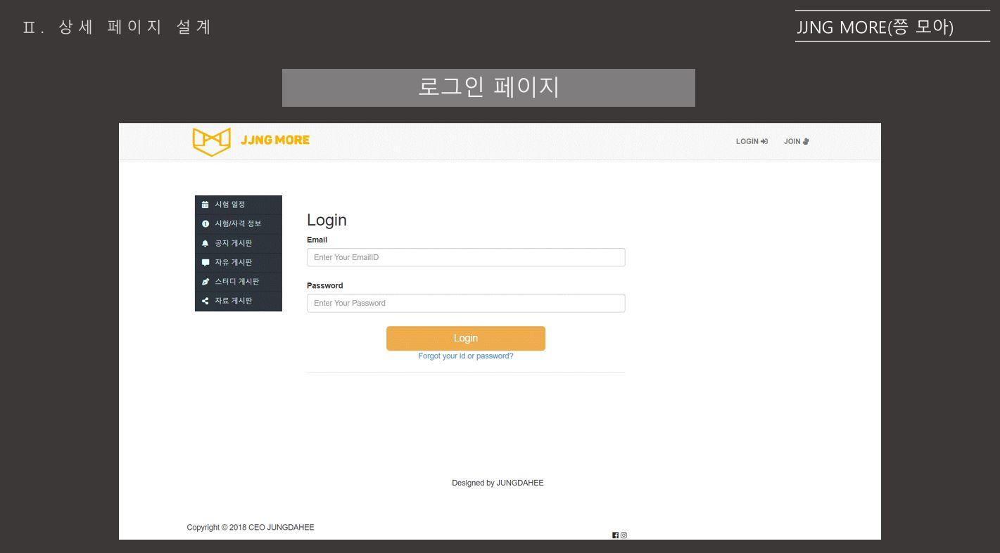

* 회원가입 페이지
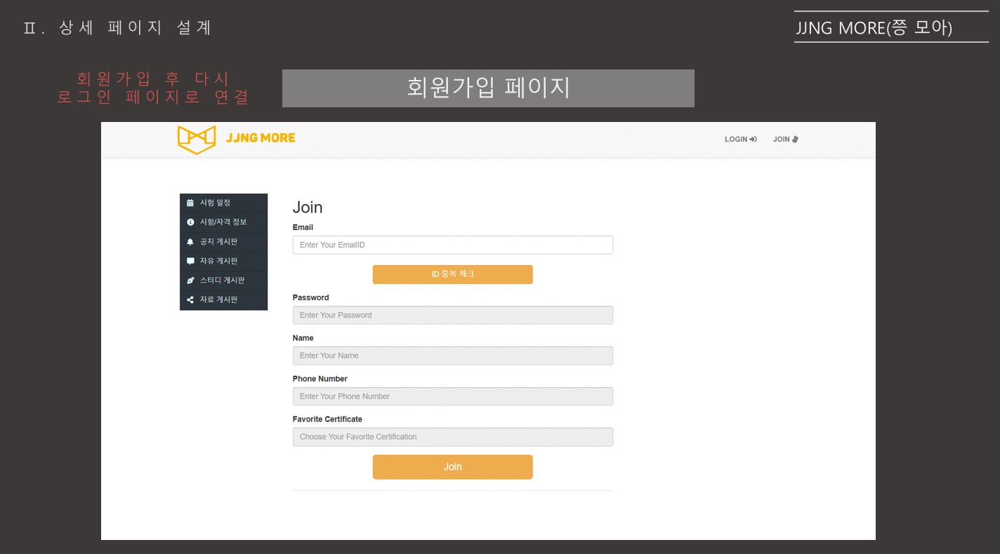

* 시험 정보 및 자격 정보 검색(관심자격증 미등록 시)
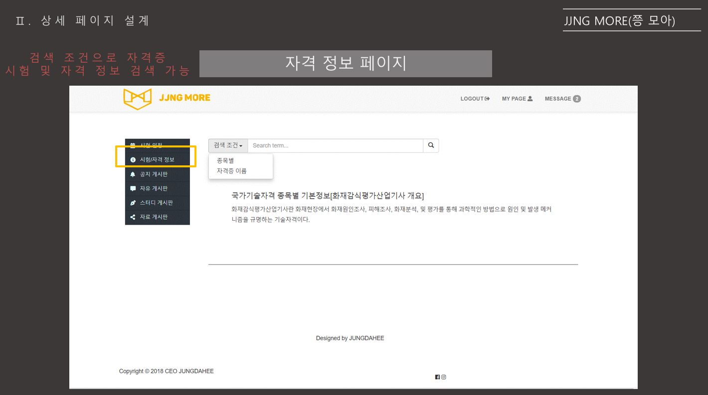

* 시험 정보 및 자격 정보 검색(관심자격증 등록 시)
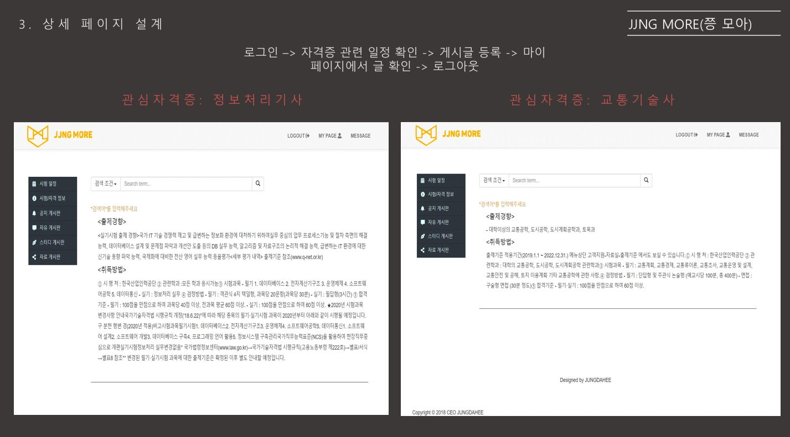

* 시험 일정
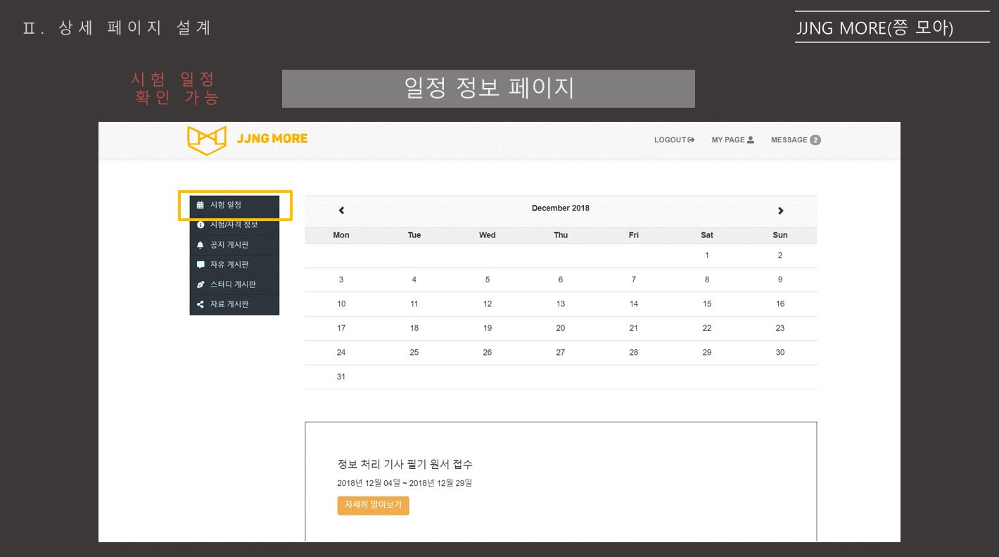

* 공지게시판
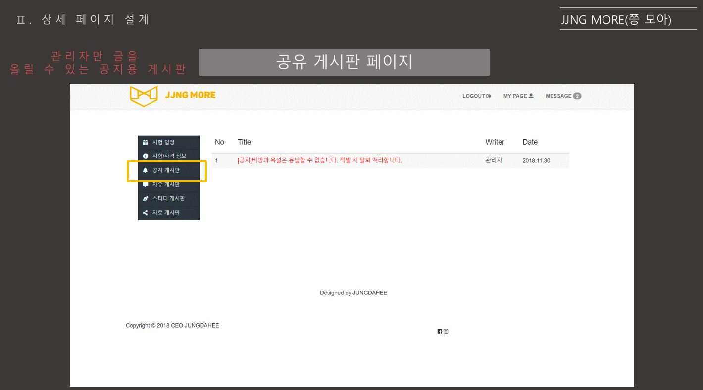

* 스터디게시판
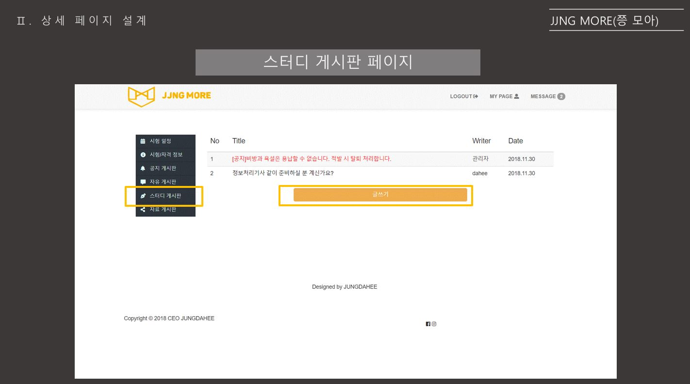

* 자유게시판 글 등록
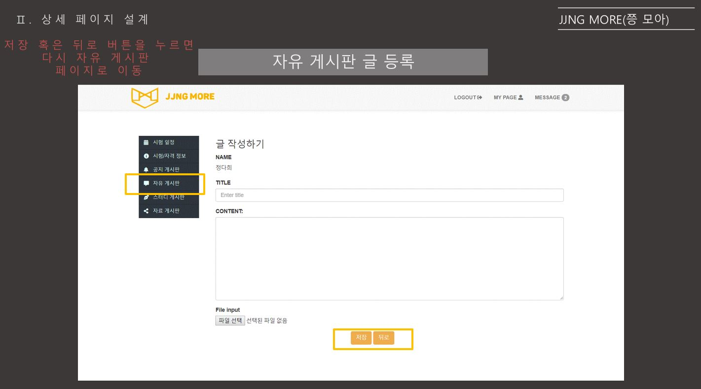

* 마이페이지
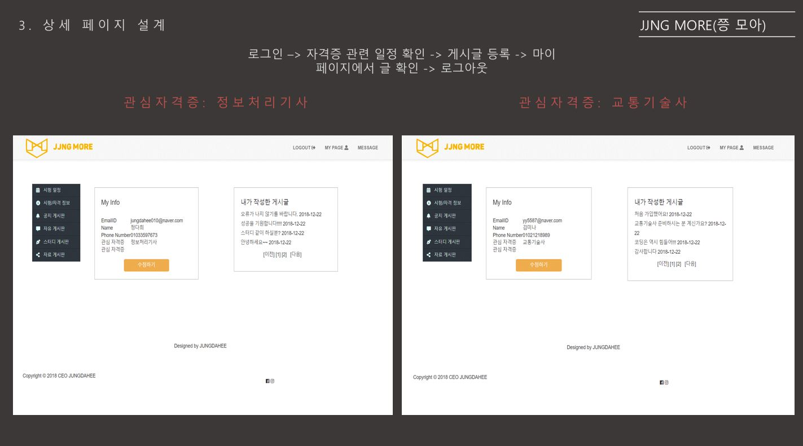

* 내 정보 수정
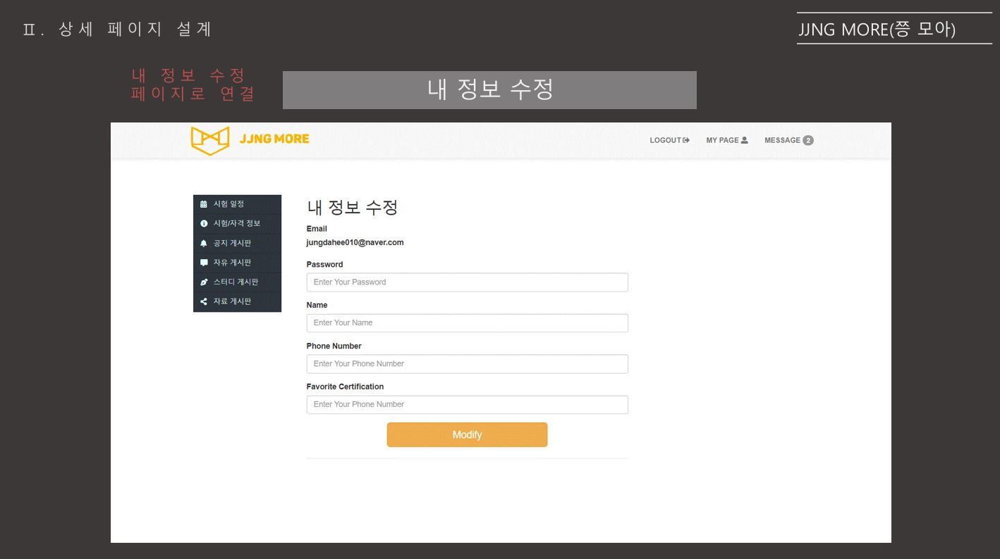

* 알림 화면
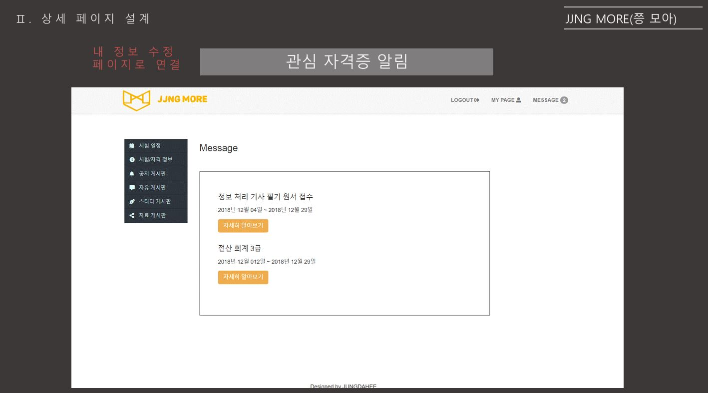

* 관리자 페이지
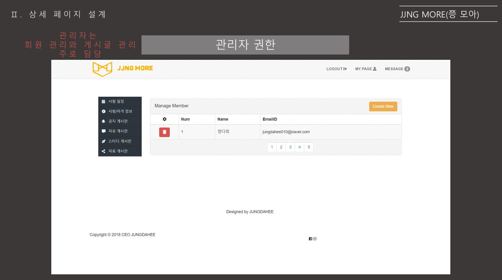

